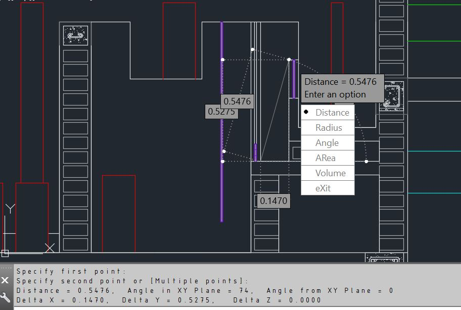

# Filter Entrance Weirs Head Loss Check

Mysteriously, the control slot weir in Zamorano is considerably smaller than that in Las Vegas. I want to check that the head loss through it is what it should be.

The goal is to have the height of water behind that weir in a given filter be equal to the height of the first entrance weir when the flow rate entering that filter is 1.15 the design flow rate. That height is 52.7 cm, as shown below:



```python
# %%

from aide_design.play import *

Q_plant = 40*(u.L/u.s)
N_filter = 2
Q_filter = Q_plant/N_filter
Q_filter_backwash = 1.15*Q_filter
W_weir_as_built = 4.5*u.cm

headloss_backwash = pc.headloss_weir(Q_filter_backwash,W_weir_as_built)

h_between_weirs = 52.7*u.cm
h_stopper = h_between_weirs - headloss_backwash

print(headloss_backwash)
print(h_stopper)
```
The height of water before the slotted weir during backwash is 42.72 cm. In order for flow to be distributed correctly, a stopper of height 10cm should be added.
