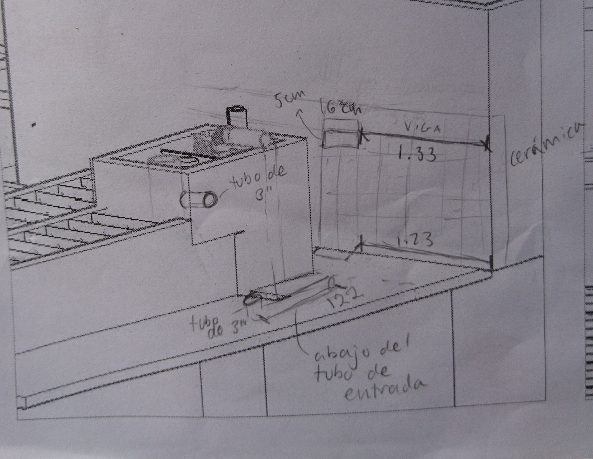
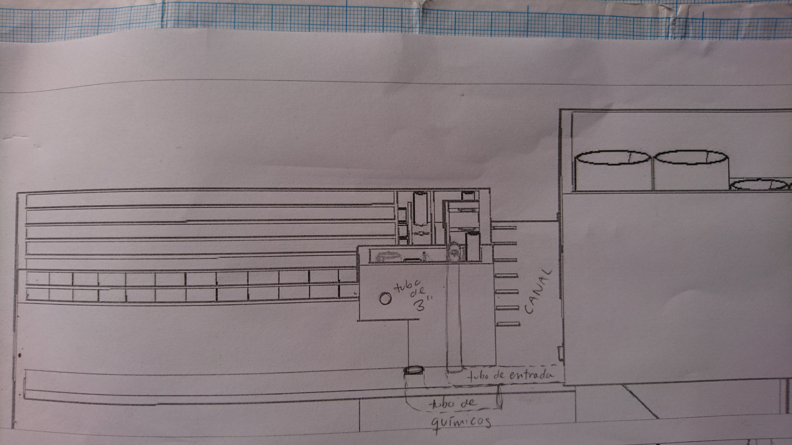
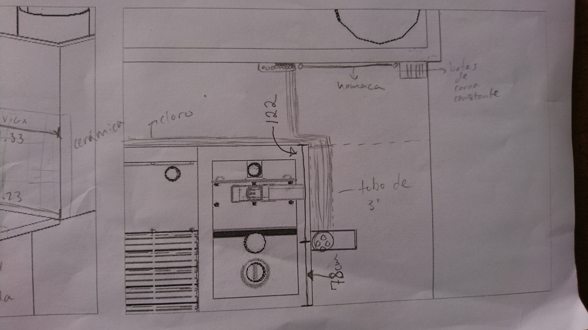

## Sistema de químicos para Zamorano

Necesitamos definir las ubicaciónes de los elementos del sistema de dosificación y también los largos de las mangueras de pérdida de carga mayor.

Primero calculo los largos:

```python
# %% importing
from aide_design.play import *
from aide_design import cdc_functions as cdc
from aide_design.unit_process_design.prefab import lfom_prefab_functional as lfom

#Defining variables (stock concentrations, dosages taken from Mathcad)
FlowPlant = 40*u.L/u.s
T = u.Quantity(20,u.degC)
NuWater = pc.viscosity_kinematic(T)
HeadlossDosingTubeMax = 20*(u.cm)
RatioError = 0.1
KMinor = 2
DiamTubeArray = np.array(np.arange(1/16,6/16,1/16)) * u.inch
LenCDCTubeMax = 1.3*(u.m)
en_chem=1

StockCoag = 159.091*(u.gram/u.L)
DoseCoag = 40*(u.mg/u.L)

StockCl2 = 7.76*(u.gram/u.L)
DoseCl2 = 2*(u.mg/u.L)

StockOrto = 1450*(u.gram/u.L)
DoseOrto = 7.3*(u.mg/u.L)

dose_list = [DoseCoag, DoseCl2, DoseOrto]
stock_list = [StockCoag, StockCl2, StockOrto]

diam_list = []
L_tube_list = []
n_tube_list = []

# Caculating...
for ConcDoseMax, ConcStock in zip(dose_list, stock_list):
  diam_list.append(cdc.diam_cdc_tube(FlowPlant, ConcDoseMax, ConcStock,
                  DiamTubeArray, HeadlossDosingTubeMax, LenCDCTubeMax,
                  T, en_chem, KMinor).to(u.inch))
  L_tube_list.append(cdc.len_cdc_tube(FlowPlant, ConcDoseMax, ConcStock,
                  DiamTubeArray, HeadlossDosingTubeMax, LenCDCTubeMax,
                  T, en_chem, KMinor))
  n_tube_list.append(cdc.n_cdc_tube(FlowPlant, ConcDoseMax, ConcStock,
                  DiamTubeArray, HeadlossDosingTubeMax, LenCDCTubeMax,
                  T, en_chem, KMinor))

print(diam_list)
print(L_tube_list)
print(n_tube_list)

```
Resultados (toda la manguera es de 1/8"):

Químico | Largo de las mangueras | Número de mangueras
------------ | ------------- | ------------------------
Coagulante | 0.98 m | 4
Cloro | 1.28 m | 4
Ortofosfato | 1.01 m | 2


Ahora, las ubicaciones:

La hamaca y los botes de carga constante van en la pared al fin del paseo. Arriba de la ventana en el piso, justo abajo de la viga va otra ventana. Allí van a pasar los drenajes de los tanques y  la tubería hacia los botes, los cuales van a estar en el rincón para no estorbar el paseo. Todo el espacio entre la ventana y el otro pared debe de llevar cerámica.   

Despues de la hamaca la tubería pasa por un tubo de 3" abajo del tubo de entrada hasta la balanza. Van 4 tubos: los 3 a la balanza para dosificación y un cuarto para llevar el cloro a la salida.

Para pasar los químicos de la balanza a la mezcla rápida sugiero dejar un pedazo de tubo de 3" en la pared en el espacio abierto abajo del pendiente que forma el piso del tanque de entrada. Si no es posible también podemos pasar la manguera encima de la pared del flocculador y luego a la mezcla rápida.







